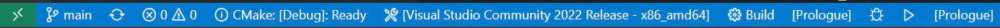

# For Developers

開発者向けドキュメント

物理とか風とか解析部分ついては[ここ](https://github.com/FROM-THE-EARTH/Prologue/blob/master/docs/DYNAMICS.md)

## 開発環境等

|                  |                    |
| ---------------- | ------------------ |
| 使用言語         | C++ 20             |
| エディタ         | Visual Studio Code |
| ライブラリ       | boost 1.71.0       |
| 外部ソフトウェア | Gnuplot 5.2.8      |

Visual Studio Code での開発を想定して環境構築しているため、エディタは VSCode を使用し、推奨拡張機能をインストールして開発してください。

## ビルド

ビルドは VSCode の拡張機能 CMakeTools を利用して行います。VSCode でこのリポジトリを開くと CMakeTools が自動的に構成を開始します。

ビルドする際は VSCode 下部にある画像の部分で Debug / Release 切り替えやビルド・デバッグの実行をします。

## バージョン管理について

**基本のバージョン表記は x.y.z です。**

- x は大幅な仕様変更があった場合にインクリメントします。(以前のバージョンとの互換性が無くなるくらい)

- y は互換性はあるが、仕様にそれなりの変更があった場合にインクリメントします。

- z はバグ修正や軽微なアップデートなどを行った場合にインクリメントします。

## 配布方法

配布は GitHub Actions を通して半自動的に行われます。

配布の流れは以下のようになっています。

1. ソースコードの修正が完了し、更新準備が整う
2. `main.cpp`の`const auto VERSION = "X.X.X"` を書き換える
3. `README.md`のバージョン・日付・更新履歴を修正する
4. 上記作業が終了したコミットに`vX.X.X`とタグをつけ、リモートにプッシュする（例 `v1.2.3`）
   タグを付けたコミットに不具合があり、バージョンを変更せずにリリース作業をやり直す場合、不具合を修正したコミットに`vX.X.X.X`とタグを付けリモートにプッシュする（例 `v1.2.3.1`, `v1.2.3.2`）
5. [Actions] タグに反応して`release.yml`のワークフローが実行される
6. [Releases](https://github.com/FROM-THE-EARTH/Prologue/releases) に`vX.X.X`を名前として Windows, macOS, Linux 向けの実行ファイル・設定ファイル・入力ファイルを同包した zip ファイルが登録される
