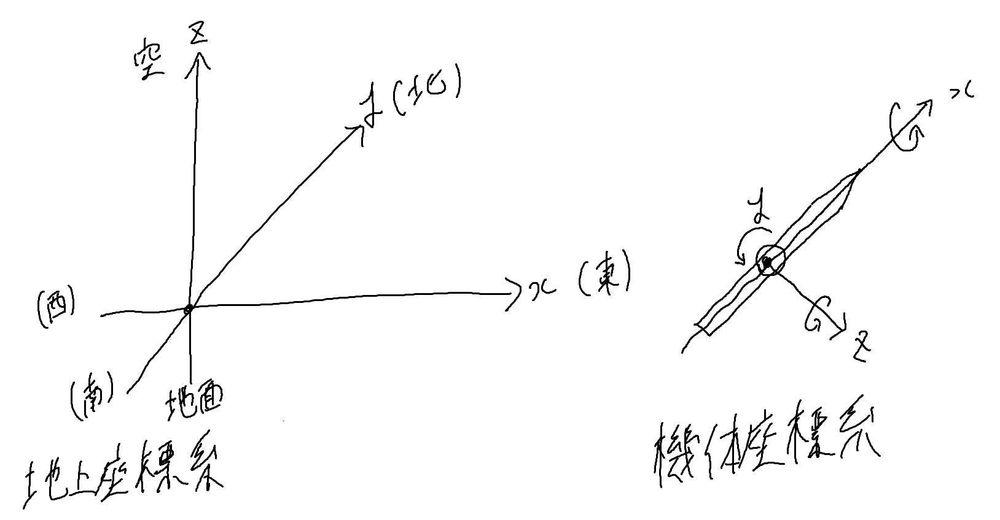

# 諸々の定義

## 座標系

使用している座標系は 2 つ有ります。

- 地上座標系：普通の座標です。x 方向を東方向、y 方向を北方向、z 方向を鉛直上向きの方向としています。原点は打上点です。
- 機体座標系：機体座標系の項で説明します。

## 方角の定義

北を 0 度、東を 90 度とし、時計回りに方角を定義しています。

## 風

風向が 0 度のとき、それは北から南へ吹く風で、ベクトルとしては Vector3D(-1, 0, 0)となります。風向が 45 度の場合は Vector3D(-1, -1, 0)です。

## 磁気偏角

磁気偏角は風向きと射出方位に対して回転を施すことで考慮しています。
角度は以下の通りで、風向きと射出方位を左回りに回転させています。

単位：度

- 能代陸: 8.9
- 能代海: 8.94
- 伊豆陸: 7.53
- 伊豆海: 7.53

## 機体座標系

機体座標系の原点は**ロケットの重心**です。x 方向は機体のノーズ方向、y,z 軸は機体に垂直な方向です。y,z 軸は対称なので実質同じみたいな感じです。

また、回転方向は右ねじの法則です。

プログラムにおいて、機体座標系を用いる変数には添字"**\_b**"をつけています。

# クォータニオン

機体の姿勢演算にはクォータニオンをゴリゴリ使ってます。以下のサイトが参考になりそうです。

- [Qiita / Quaternion を総整理](https://qiita.com/drken/items/0639cf34cce14e8d58a5)
- [Wikipedia / Conversion between quaternions and Euler angles](https://en.wikipedia.org/wiki/Conversion_between_quaternions_and_Euler_angles)
- [NASA / Euler Angles, Quaternions, and Transformation Matrices](https://ntrs.nasa.gov/archive/nasa/casi.ntrs.nasa.gov/19770024290.pdf)

正直良くわかりませんが、とりあえず姿勢があってて軌道もそれっぽいのが出てる気がするのでいいかなという感じです。物理つよつよマンいたら計算があってるのか確認してみてください。

# シミュレーション

軌道、姿勢のシミュレーションは微分方程式で行っています。

プログラム見ると微分方程式っぽくないかもしれませんが微分方程式らしいです。指定した delta_time 毎のステップで各パラメータの delta を計算し、以前の状態に加算することでシミュレーションできているようです。

# 風モデル

独自開発した風モデルについてです。定義は以下の通りです。

- 大気を高度別に 4 つの層に分けて計算する.
- 磁気偏角は地図を回転することで考慮するため,ここでは考慮せずに計算する.
- 角度は真北を 0 度,時計回りとする.
- 地衡風速を 15m/s とする.

| 名称       | 高度       | 計算方法                                                                                                                                                                                                                                                                                                           |
| :--------- | :--------- | :----------------------------------------------------------------------------------------------------------------------------------------------------------------------------------------------------------------------------------------------------------------------------------------------------------------- |
| 地上       | 0m 以下    | 指定した地上風を与える                                                                                                                                                                                                                                                                                             |
| 接地層     | 300m 未満  | 1. 地上風の風向を 1000m で 90 度方向に吹くように回転させる. 2. 地上風の風速に係数を 6.0 としたべき風速を適用する.                                                                                                                                                                                               |
| エクマン層 | 1000m 未満 | 1. 地上風の風向を 1000m で 90 度方向に吹くように回転させる. 2. 地上風の風速に係数を 7.0 としたべき風速を適用する. 3. 2 の計算結果に対し,1000 ｍで影響が無くなるように徐々に減衰させる. 4. 参考文献に従い,エクマン層における風を計算する. 5. 3 と 4 の結果を足し合わせたものをその高度における風とする. |
| 自由大気   | 1000m 以上 | 地衡風速, 90 度方向への風(西風)を与える.                                                                                                                                                                                                                                                                           |

- [参考文献](http://kishou.u-gakugei.ac.jp/graduate/local/doc04.pdf)
