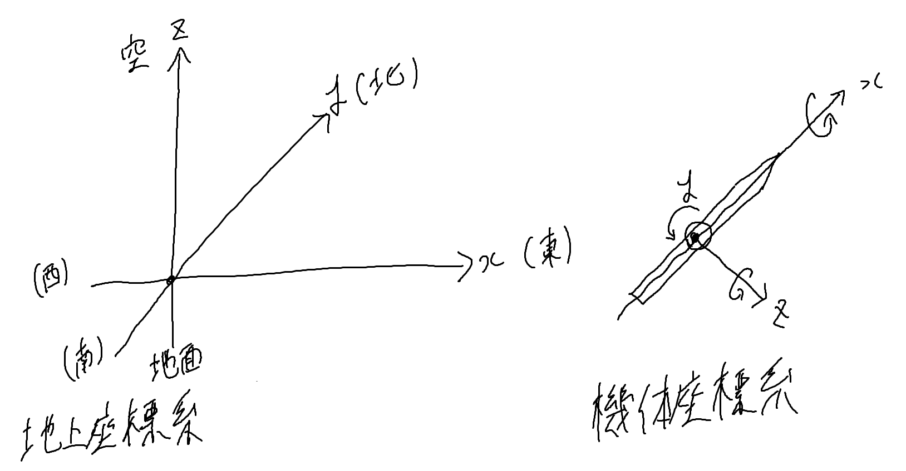

# 諸々の定義

## 座標系

使用している座標系は 2 つ有ります。

- 地上座標系：普通の座標です。x 方向を東方向、y 方向を北方向、z 方向を鉛直上向きの方向としています。原点は打上点です。
- 機体座標系：機体座標系の項で説明します。

## 方角の定義

北を 0 度、東を 90 度とし、時計回りに方角を定義しています。

## 風

風向が 0 度のとき、それは北から南へ吹く風で、ベクトルとしては `Vector3D(0, -1, 0)`となります。（y 軸負方向＝南に風が吹いてるイメージ）

風向が 45 度の場合は `Vector3D(-1, -1, 0)`です。

## 磁気偏角

磁気偏角は風向きと射出方位を左回りに回転することで考慮しています。

## 機体座標系

機体座標系の原点は**ロケットの重心**です。x 方向は機体のノーズ方向、y, z 軸は機体に垂直な方向です。y, z 軸は対称なので実質同じみたいな感じです。

また、回転方向は右ねじの法則です。

プログラムにおいて、機体座標系を用いる変数には添字`\_b`をつけています。

# クォータニオン

機体の姿勢演算にはクォータニオンをゴリゴリ使ってます。以下のサイトが参考になりそうです。

- [Qiita / Quaternion を総整理](https://qiita.com/drken/items/0639cf34cce14e8d58a5)
- [Wikipedia / Conversion between quaternions and Euler angles](https://en.wikipedia.org/wiki/Conversion_between_quaternions_and_Euler_angles)
- [NASA / Euler Angles, Quaternions, and Transformation Matrices](https://ntrs.nasa.gov/archive/nasa/casi.ntrs.nasa.gov/19770024290.pdf)

正直良くわかりませんが、とりあえず姿勢があってて軌道もそれっぽいのが出てる気がするのでいいかなという感じです。物理つよつよマンいたら計算があってるのか確認してみてください。

# シミュレーション

軌道、姿勢のシミュレーションは微分方程式で行っています。

プログラム見ると微分方程式っぽくないかもしれませんが微分方程式らしいです。指定した delta_time 毎のステップで各パラメータの delta を計算し、以前の状態に加算することでシミュレーションできているようです。

# 大気モデル

大気モデルは、風モデルの設定 (`real`, `original`, `only_powerlow`, `no_wind`) にかかわらず共通です。
[U.S. Standard Atmosphere, 1976](https://ntrs.nasa.gov/citations/19770009539) の 0～32 km のジオポテンシャル高度における定義に従い、`StandardAtmosphere1976` で気温、気圧、密度、重力加速度を計算します。

幾何高度 $z$ [m] は、有効地球半径 $r_0=6,356,766$ m を用いてジオポテンシャル高度 $H$ [m] に変換します。

$$
H = \frac{r_0 z}{r_0 + z}
$$

各層の基準値は次の通りです。気温減率 $L$ はジオポテンシャル高度に対する値です。

| ジオポテンシャル高度 $H$ | 基準気温 | 気温減率 $L$ |
| :-- | --: | --: |
| 0～11,000 m | 288.15 K | -0.0065 K/m |
| 11,000～20,000 m | 216.65 K | 0 K/m |
| 20,000～32,000 m | 216.65 K | +0.001 K/m |

層の基準高度を $H_b$、基準気温を $T_b$、基準気圧を $P_b$、標準重力加速度を $g_0=9.80665$ m/s²、乾燥空気の比気体定数を $R^*/M_0$ とすると、気温と気圧は次式で求めます。

$$
T = T_b + L(H-H_b)
$$

気温減率が 0 でない層では、

$$
P = P_b \left(\frac{T}{T_b}\right)^{-g_0/(L(R^*/M_0))}
$$

等温層では、

$$
P = P_b \exp\left(-\frac{g_0(H-H_b)}{(R^*/M_0)T_b}\right)
$$

を使用します。密度は状態方程式 $\rho=P/((R^*/M_0)T)$ から計算します。定数は NASA 資料の $R^*=8314.32$ J/(kmol K)、$M_0=28.9644$ kg/kmol を使用します。

`prologue.settings.json` の海面気圧 101325 Pa、海面温度 15 ℃が標準値です。この値を変更した場合、層境界の気温と気圧を前の層から再計算して連続性を保ちますが、結果は U.S. Standard Atmosphere, 1976 の標準値から外れます。

実装範囲の上限 32,000 m は含み、それを超えるジオポテンシャル高度は未定義としてエラーにします。

# 風モデル (`original`)

以下は `prologue.settings.json` の `wind_model.type` に `original` を指定した場合の風モデルです。コード上では `WindModel::getWindOriginalModel()` に対応します。

- 大気を高度別に 4 つの層に分けて計算する.
- 角度は真北を 0 度,時計回りとする.
- 地衡風速を 15m/s とする.
- エクマン層の $u$, $v$ は地上座標系の水平成分（東向き、北向き）とし、鉛直風は与えない.

| 名称       | 高度       | 計算方法                                                                                                                                                                                                                                                                                                           |
| :--------- | :--------- | :----------------------------------------------------------------------------------------------------------------------------------------------------------------------------------------------------------------------------------------------------------------------------------------------------------------- |
| 地上       | 0m 以下    | 無風とする                                                                                                                                                                                                                                                                                                         |
| 接地層     | 300m 未満  | 1. 地上風の風向を 1000m で 90 度方向に吹くように回転させる. 2. 地上風の風速に設定値 `power_constant` を用いたべき法則を適用する.                                                                                                                                                                                |
| エクマン層 | 1000m 未満 | 1. 地上風の風向を 1000m で 90 度方向に吹くように回転させる. 2. 地上風の風速に設定値 `power_constant` を用いたべき法則を適用する. 3. 2 の計算結果に対し,1000 ｍで影響が無くなるように徐々に減衰させる. 4. 参考文献に従い,エクマン層における風を計算する. 5. 3 と 4 の結果を足し合わせたものをその高度における風とする. |
| 自由大気   | 1000m 以上 | 地衡風速, 90 度方向への風(西風)を与える.                                                                                                                                                                                                                                                                           |

- [参考文献](http://kishou.u-gakugei.ac.jp/graduate/local/doc04.pdf)

他の `wind_model.type` は次の処理を選択します。

| 設定値 | 処理 |
| :-- | :-- |
| `real` | 指定した風向風速データを高度方向に線形補間する |
| `only_powerlow` | 指定した地上風にべき法則だけを適用する |
| `no_wind` | 全高度で無風とする |
